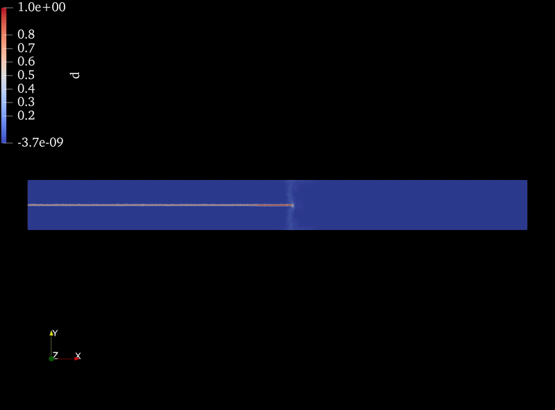

# Crack Propagation due to Spatially Varying Temperature Field

## Motivation and Introductory Maths

Problems related to growth and fracture have been a topic of interest for some time now. Not only these systems are rich in physics but we also get to observe some very beautiful patterns and colors, for example check out this work by [Atis et al](https://journals.aps.org/prx/abstract/10.1103/PhysRevX.9.021058) about how a yeast colony tears itself apart in search for nutrients:

Here's another example from [Plummer et al](https://pubs.rsc.org/en/content/articlelanding/2024/sm/d3sm01470c) in which a hydrogel is allowed to swell in a constrained environment.

Even though the field of fracture mechanics is at least a century old, but still it is very difficult to be confident about the numerical simulations one is running related to it. And the literature related to growth and fracture is not very vast but thankfully, growth strains and thermal strains are implemented on a system in exactly similar fashion (Please note that the discussion here is limited to implementing growth or thermal strains, but not the physics behind how those strains are being produced in the first place. For more information, please check out the chapters 13 and 14 of the book on biological growth by [Alain Goriely](https://link.springer.com/book/10.1007/978-0-387-87710-5)). 

The deformation gradient $F$ can be decomposed into the product of two tensors, $A$ due to residual stresses and $G$ (or $T$ for thermal strain) due to growth

$$\mathrm{F} = \mathrm{AG}$$

Where $\mathrm{F} = \mathrm{I} + \mathrm{grad}(u)$ as usual. Therefore,

$$\mathrm{A} = \mathrm{FG^{-1}}$$

Now $\mathrm{A}$ can be used to write all of the required quantities like Cauchy strain tensor, stress tensor, energy functional, etc. like we usually do for elaticity analysis. It can also be shown that in case of linear elasticity, the above mentioned expressions can be reduced to:

$$e = \epsilon - g$$

Where $e$ is the strain due to elastic behavior, $\epsilon$ is the total strain and $g$ is the growth strain. This expression can also be found in the book [Theory of Elasticity by Timoshenko and Goodier](https://asmedigitalcollection.asme.org/appliedmechanics/article/37/3/888/427761/Theory-of-Elasticity-3rd-ed) in terms of thermal strains. Then stresses can be written as:

$$\sigma_{ij} = \lambda e_{kk}\delta_{ij} + 2\mu e_{ij}$$

## Problem Statement

[Yuse and Sano](https://www.nature.com/articles/362329a0) performed an experiment in 1993 in which they pulled a long thin glass strip from a heated oven to a cold bath. They found out that as the velocity of pulling is increased, then a straight crack appears. Further increase in velocity leads to oscillatory cracks and further increase leads to bifurcation.

A lot of effort has gone into understanding this problem of how these reproducible patterns are observed even though fracture itself is a highly non linear phenomenon. [Mokhtar and Yves](https://journals.aps.org/pre/abstract/10.1103/PhysRevE.52.4105) did a linear stability analysis to identify the different conditions for crack propagation.

In this figure, $P = bv/D$ where $b$ is the half width of the glass strip, $v$ is the velocity and $D$ is the diffusion constant. On *y*-axis, $K_I$ is the stress intensity factor for mode-I cracks, $\alpha_T$ is the coefficient of thermal expansion, $\Delta T$ is the difference in temperature from cold bath to heated oven, $E$ is the Young's modulus and $\Gamma$ is the energy release rate. It has to be noted that the lower solid line represents where crack starts propagating in the phase diagram. So $\Gamma$ corresponding to this line can also be called as $\Gamma_c$ (critical energy release rate). 

The goal for this project is to mimic the similar system to run the numerical simulations and verify crack propagation for different regimes.

Now, one way to simulate this system is to fix the temperature regions and pull the strip, but that will require understanding how to impose velocity on the system without affecting the physics of the problem. The other way is to move the temperature field along the strip itself. If there's one unusal thing about this problem then it's that it is free from traction as well as Dirichlet boundary conditions on all boundaries (see [Corson et al](https://link.springer.com/article/10.1007/s10704-009-9361-4)), so it is important to validate the intermediate steps related to fracture simulation before running these simulation itself.

## Setting up the Problem
Since there are no boundary conditions to restrict rigid body motion, the elastic energy density is modified to include penalties for rigid body motion using Lagrange multipliers.

$$W = \frac{1}{2}\sigma:e + \lambda_1\cdot u + \lambda_2\mathrm{det(grad}u)$$

Where, $\lambda_1$ is a vector type Lagrange multiplier restricting rigid body displacements and $\lambda_2$ is a scalar multiplier to restrict rigid body rotations.

For the phase field evolution for simulating the crack propagation, formulation given by [Ambati et al](https://link.springer.com/article/10.1007/s00466-014-1109-y) is used. Damage parameter $d = 1$ represents cracked state and $d = 0$ represents intact state. The formulation for energy functional associated with phase field evolution is omitted as it might create unnecessary confusion. Reader is requested to give a look to the work of [Ambati et al](https://link.springer.com/article/10.1007/s00466-014-1109-y) and [Miehe et al](https://onlinelibrary.wiley.com/doi/abs/10.1002/nme.2861) to understand the derivation of the energy functional for phase field evolution.

## Validation

As it was mentioned earlier, that it might be really difficult to be one hundred percent sure of numerical simulations related to fracture. So it is important to break down the problem into smaller chunks and verify them one by one before moving to the coupled problem.

### 1. Crack propagation due to simple loading

To verify if the phase field evolution itself is working, a crack propagation simulation was run and the energy release rate $G$ was recorded before the crack propagation started. This was done to ensure that the numerical result can be verified against a similar problem for which analytical result is known. A 2D square plate seeded with a straight edge crack was pulled with uniform displacements at top and bottom as shown in the figure.

The variation of $G$ with increasing uniform displacement can be seen in the following figure.

Please note that $G$ is being recorded only until the point before the crack propagation starts because the [analytical result](https://www.sciencedirect.com/book/9780123850010/fracture-mechanics) exists for an infinite body with semi infinite crack subjected to similar loads. So comparison can only be made before the crack propagation starts as the energy release rate's value will change once the crack propagation has started.

The energy release rate is calculated using the [domain J-integral method](https://link.springer.com/book/10.1007/978-94-007-2595-9).

### 2. Free contraction of a material due to decreasing temperature.

Schematic from the previous section should be enough to explain this. The only difference is that the displacement boundary condition has been removed from top and bottom and the domain is allowed to freely expand and contract. Temperature is decreased for the whole domain uniformly so that it leads to uniform shrinkage.

Clearly, there's no change in crack itself but the whole domain is shrinking. We can further verify if the simulation is working or not by looking at the stress fields.

We can see that the stresses are more or less zero (the values being orders of magnitude small).

**Note:** The information for running scripts for generating the above mentioned and upcoming results is provided later in the Reproducibility section.

## Results

Now that we have ensured that the scripts are working fine, so we can move on to visualizing the different crack propagation scenarios.

### No Crack Propagation

### Straight Crack Propagation

### Oscillatory Crack

### Phase Diagram

This phase diagram was taken from the works of [Mokhtar and Yves](https://journals.aps.org/pre/abstract/10.1103/PhysRevE.52.4105) and the data points from their plot were extracted using [this tool](https://web.eecs.utk.edu/~dcostine/personal/PowerDeviceLib/DigiTest/index.html).

- The points in red are the ones where no crack propagation was observed.
- The points in green are the ones where straight cracks were observed.
- The blue data point is where oscillatory crack was observed.

## Reproducibility
